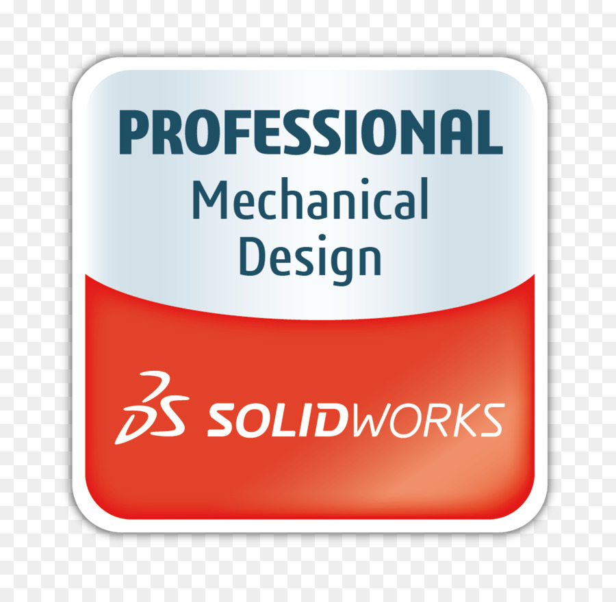
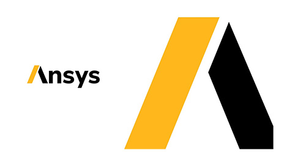

# Hi there, I`m Armanc :wave: 

## M.S in Robotics Engineering | Mechanical Design Engineer

 
 🔭 I am currently working as a research assistant at  <a href="https://www.medibot.kist.re.kr/">Korea Institute of Science and Technology | Center for Healthcare Robotics </a> as well as I`m a master student in the field of Robotic Engineering at  <a href="https://www.ust.ac.kr/eng.do">University of Science and Technology Korea</a>.   
 🧑🏽‍💻 I am a Junior Mechanical Design Engineer.    
 🧑🏽‍🎓 I have graduated from Mechanical Engineering and Energy Systems Engineering (Double Degree Program) with CGPA:3.50/4.00 at <a href="https://www.bilgi.edu.tr/en/"> Istanbul Bilgi University</a>.   
 📚 Besides 3D CAD modeling, I have the intention of improving my coding skills to be able to control robots.

## Reach out to me

 

### Tech I use

</a>

### Personal Website 
 

 

  

<!--
Here are some ideas to get you started:

- 🔭 I’m currently working on ...
- 🌱 I’m currently learning ...
- 👯 I’m looking to collaborate on ...
- 🤔 I’m looking for help with ...
- 💬 Ask me about ...
- 📫 How to reach me: ...
- 😄 Pronouns: ...
- ⚡ Fun fact: ...
-->
